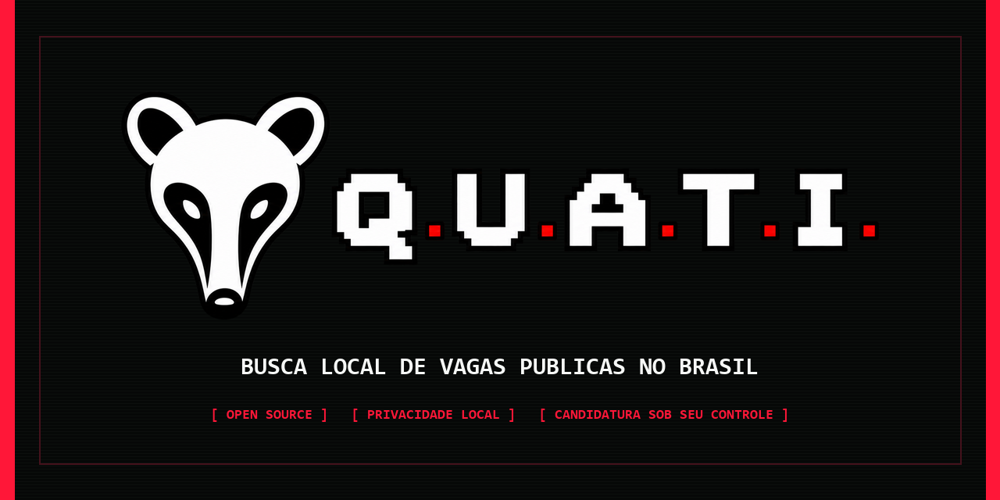
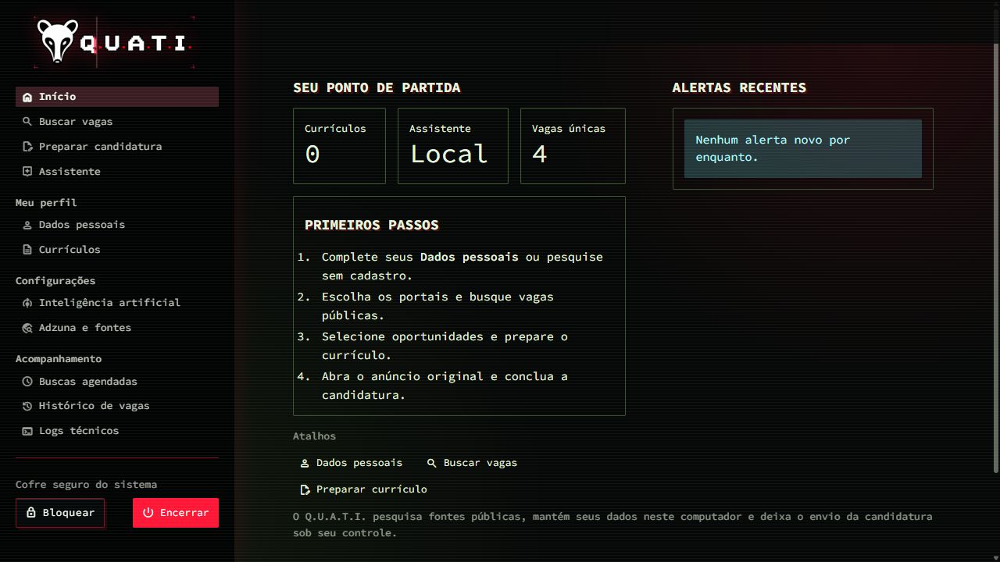
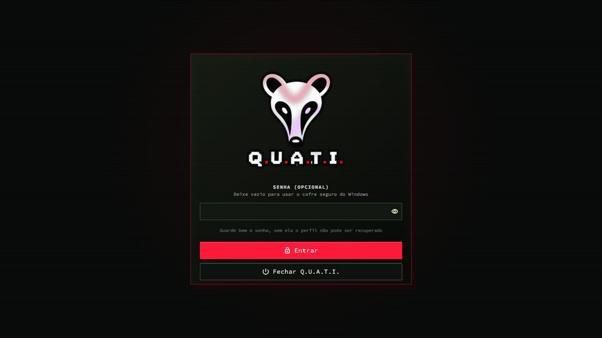
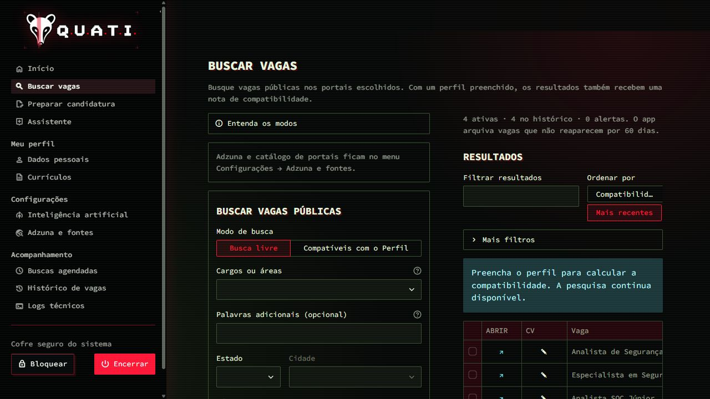
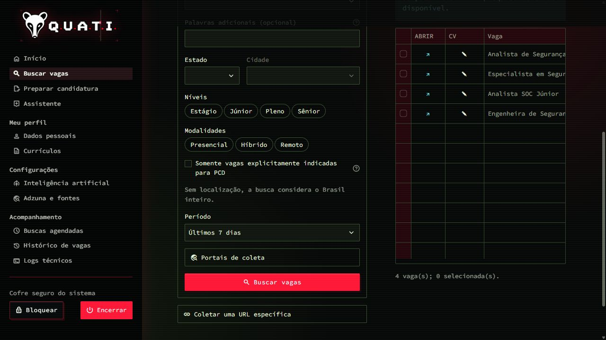
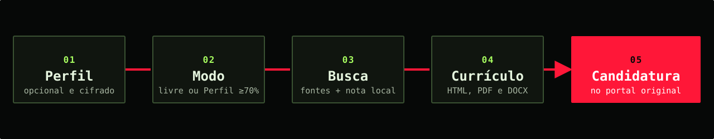

<p align="center">
  
</p>

<p align="center">
  <a href="https://github.com/redp4w/quati-buscador-de-vagas-BR/actions/workflows/quality.yml"></a>
  <a href="LICENSE"></a>
  
  
  
</p>

<p align="center">
  <strong>Buscador de vagas públicas BR</strong><br>
  <sub>Query Unificada de Anúncios de Trabalho na Internet</sub>
</p>

<p align="center">
  <a href="#o-que-é-o-quati">Visão geral</a> ·
  <a href="#como-funciona">Como funciona</a> ·
  <a href="#portais">Portais</a> ·
  <a href="#instalação">Instalação</a> ·
  <a href="docs/USER_GUIDE.md">Guia de uso</a> ·
  <a href="CONTRIBUTING.md">Contribuir</a>
</p>

> [!IMPORTANT]
> O Q.U.A.T.I. está em fase **Alpha**. Ele já pode ser testado, mas portais e formatos de dados
> ainda podem mudar entre versões.

## O que é o Q.U.A.T.I.

O Q.U.A.T.I. é uma central local e aberta para pesquisar vagas públicas brasileiras. Ele reúne fontes
compatíveis, ajuda a ordenar oportunidades pelo seu perfil e prepara currículos revisáveis. O envio
da candidatura continua no portal original, sob sua decisão.

<table>
  <tr>
    <td width="50%" valign="top">
      <h3>Busca em vários portais</h3>
      <p>Consulta fontes públicas brasileiras, reúne os resultados e remove vagas duplicadas.</p>
    </td>
    <td width="50%" valign="top">
      <h3>Compatibilidade explicada</h3>
      <p>Compara cargo, senioridade, competências, distância e modalidade usando o perfil salvo.</p>
    </td>
  </tr>
  <tr>
    <td width="50%" valign="top">
      <h3>Currículo para cada vaga</h3>
      <p>Importa PDF/DOCX e gera versões revisáveis em HTML, PDF e DOCX.</p>
    </td>
    <td width="50%" valign="top">
      <h3>Controle local</h3>
      <p>Perfil, currículos e configurações sensíveis ficam em cofres no seu computador.</p>
    </td>
  </tr>
</table>

## Página inicial

A captura abaixo foi produzida em um ambiente local com conteúdo exclusivamente sintético. Ela não
contém nome de pessoa, empresa, credencial ou dado de busca real.

<p align="center">
  
</p>

<p align="center"><sub>Indicadores, primeiros passos e alertas locais em uma única visão.</sub></p>

<details>
  <summary><strong>Ver primeiro acesso, busca e resultados</strong></summary>

<table>
  <tr>
    <td width="50%" valign="top">
      
    </td>
    <td width="50%" valign="top">
      
    </td>
  </tr>
  <tr>
    <td align="center"><sub>Acesso local com senha opcional e cofre seguro do sistema.</sub></td>
    <td align="center"><sub>Pesquisa por cargo, local, nível, modalidade, PCD e portal.</sub></td>
  </tr>
</table>

<p align="center">
  
  <br><sub>Resultados sintéticos ordenados, sem nomes de empresas ou dados pessoais.</sub>
</p>

</details>

> Todas as telas públicas usam somente conteúdo sintético, criado para demonstrar o projeto.

## Como funciona

<p align="center">
  
</p>

1. **Crie seu perfil ou pesquise sem cadastro.** O perfil é opcional para a busca e necessário para
   calcular a compatibilidade.
2. **Escolha o modo.** Faça uma busca livre ou use o Perfil para procurar somente vagas com 70% ou
   mais de compatibilidade.
3. **Compare as vagas.** A nota usa apenas os dados do perfil, e os detalhes mostram os sinais que
   contribuíram para o resultado.
4. **Prepare o currículo.** Revise o texto, organize as seções e gere HTML, PDF ou DOCX.
5. **Conclua no portal original.** O Q.U.A.T.I. abre a vaga; você revisa e envia a candidatura.

## O que está incluído

| Área | O que você encontra |
|---|---|
| **Buscar vagas** | busca livre ou por Perfil (≥70%), filtros, deduplicação e arquivamento |
| **Compatibilidade** | cargo 35%, senioridade 25%, competências 25% e localização/modalidade 15% |
| **Dados pessoais** | preenchimento manual ou importação local de PDF/DOCX para revisão |
| **Currículos** | biblioteca local, editor de conteúdo, modelos e exportação em três formatos |
| **PCD** | filtro para anúncios que declaram elegibilidade para pessoas com deficiência |
| **Acompanhamento** | alertas, histórico de vagas, logs técnicos e repetição opcional de buscas públicas |
| **Assistente** | sugestões por Gemini, Ollama, API compatível ou prompt externo |
| **Privacidade** | cofres locais, servidor no loopback e nenhuma conta de portal conectada |

## Portais

| Tipo de integração | Portais |
|---|---|
| **Busca automática geral** | Adzuna, Gupy, LinkedIn, Indeed, Mindsight, Lato Jobs, Vagas.com, Sólides, InHire, Empregos.com.br e Empregando Brasil |
| **API pública por empresa** | Greenhouse, Lever, SmartRecruiters, Ashby, Recruitee e Workable |
| **Página pública específica** | Workday |
| **Busca assistida** | Jobbol, ProgramaThor e BNE |
| **Abertura no navegador** | GeekHunter, Glassdoor, Catho e demais fontes catalogadas sem conector autorizado |

Cada fonte passa por uma análise de páginas públicas, termos, `robots.txt`, limites e estabilidade.
Se um portal falhar, as demais fontes continuam funcionando. O coletor não contorna login, CAPTCHA,
bloqueios nem APIs proibidas.

Os endereços públicos ficam em [`config/job_sources.yml`](config/job_sources.yml). O catálogo inclui
empresas brasileiras no Greenhouse, Lever, SmartRecruiters e InHire, além de páginas Gupy como
atalhos assistidos. Ele pode ser substituído por `QUATI_SOURCES_FILE`. Tokens, cookies e senhas não
pertencem ao YAML.

A Adzuna exige um `app_id` e uma `app_key` gratuitos. As credenciais são informadas em
**Configurações → Adzuna e fontes** e ficam em um cofre local cifrado; não existe chave pública de
demonstração.

[Consultar a auditoria de portais](docs/PORTAL_AUDIT.md) ·
[Entender os plugins](docs/PLUGINS.md)

## Privacidade por padrão

- O servidor aceita conexões apenas em `127.0.0.1`.
- O aplicativo não conecta contas, cookies ou sessões de portais.
- Perfil, currículos e configuração de IA ficam em cofres locais independentes.
- A compatibilidade é calculada sem enviar seu perfil para um serviço externo.
- Provedores externos de texto exigem configuração e autorização.
- Vagas, currículos e respostas de IA são tratados como dados, nunca como comandos.
- A candidatura continua sob sua revisão no portal original.

[Política de privacidade](docs/PRIVACY.md) · [Política de segurança](SECURITY.md)

### Onde os dados ficam

Por padrão, tudo fica dentro da pasta `data` da cópia extraída do projeto:

| Arquivo | Conteúdo |
|---|---|
| `quati.sqlite3` | vagas públicas, coletas, histórico, alertas, candidaturas e buscas agendadas |
| `candidate-profile.enc` | Perfil profissional cifrado |
| `candidate-resumes.enc` | currículos e texto extraído cifrados |
| `ai-configuration.enc` | configuração e credenciais opcionais de IA cifradas |
| `job-source-configuration.enc` | credenciais opcionais de APIs de vagas cifradas |

Os campos de uma busca comum ficam apenas na sessão; resultados coletados e histórico ficam no
SQLite. O banco de vagas não é cifrado porque contém anúncios públicos. Perfil, currículos e
credenciais não são gravados nele.

Os arquivos `.enc` usam Fernet com chave derivada por Argon2id e salt aleatório. Cofres antigos em
PBKDF2-HMAC-SHA256 com 600.000 iterações continuam legíveis e são regravados em Argon2id assim que
a senha correta abre a sessão. Com
senha local, a senha fica somente na memória da sessão. Sem senha, o app cria uma chave aleatória e
a guarda no cofre seguro da conta do sistema operacional.

Não existe senha mestra. Se uma senha própria for perdida, **Esqueci a senha** permite recomeçar
Perfil, currículos e configurações cifradas, preservando as vagas públicas e o histórico. Para o uso
comum, deixar o campo vazio e usar o cofre do Windows é a opção recomendada.

[Ver o fluxo completo, armazenamento e criptografia](docs/USER_GUIDE.md#fluxo-do-aplicativo)

## Instalação

### Windows 11

1. Clique em **Code → Download ZIP** nesta página e aguarde o download.
2. No Explorador de Arquivos, escolha **Extrair tudo**; não execute o app dentro do ZIP.
3. Mova a pasta extraída para um local permanente, como `Documentos\QUATI`.
4. Abra `iniciar.cmd` e confirme a instalação apresentada pelo Q.U.A.T.I.
5. Aguarde a criação do ambiente e dos atalhos. O navegador abrirá ao terminar.

No primeiro uso, o próprio iniciador prepara uv, Python 3.12, as dependências registradas em
`uv.lock` e o Chromium usado na coleta e na exportação de PDF. Depois, basta usar o mesmo arquivo
ou o atalho criado. Ao fechar todas as abas do Q.U.A.T.I., o serviço local e sua porta são
encerrados automaticamente. O menu também oferece **Encerrar** para fechamento imediato.

[Ver instalação detalhada no Windows](docs/INSTALL_WINDOWS.md)

### Linux

Há instalação guiada para Ubuntu 22.04, 24.04 e 26.04 e Debian 12 e 13, em x86-64 e ARM64. Baixe e
extraia o ZIP, abra um terminal na pasta extraída e execute:

```bash
bash install-linux.sh
```

O instalador explica o que será baixado, pede autorização e cria um atalho para o aplicativo. O
serviço local encerra automaticamente quando todas as abas do Q.U.A.T.I. são fechadas.

[Ver instalação detalhada no Linux](docs/INSTALL_LINUX.md)

<details>
  <summary><strong>Ambiente de desenvolvimento</strong></summary>

```text
uv sync --python 3.12 --extra dev --frozen
uv run playwright install chromium
uv run pytest
```

Consulte [Como contribuir](CONTRIBUTING.md) para executar todas as verificações.

</details>

## Inteligência artificial é opcional

O visual do currículo é produzido localmente por HTML/CSS e Chromium. A IA não desenha o documento:
ela sugere resumos, palavras-chave e melhorias de texto que você pode aceitar ou ignorar.

| Opção | Onde o texto é processado |
|---|---|
| **Sem IA** | análise determinística no computador |
| **Ollama** | modelo executado localmente |
| **Gemini** | API externa, após autorização |
| **API compatível com OpenAI** | endereço local ou serviço HTTPS escolhido por você |
| **Prompt externo** | arquivo sem nome e contatos para revisão em outra ferramenta |

[Configurar os módulos de IA](docs/AI_PROVIDERS.md) ·
[Ver integrações opcionais](docs/OPEN_SOURCE_INTEGRATIONS.md)

## Limitações transparentes

- Resultados públicos podem ser diferentes daqueles exibidos para uma conta autenticada.
- Mudanças no HTML ou nas regras de um portal podem interromper temporariamente uma fonte.
- A compatibilidade ajuda a ordenar vagas, mas não representa a decisão de um recrutador.
- Currículos escaneados ou com muitas colunas podem exigir correção manual.
- O aplicativo não preenche nem envia formulários de candidatura automaticamente.
- Atualizações ainda são instaladas manualmente.
- Opera e outras variantes de Chromium ainda precisam de validação em instalações reais.

## Arquitetura e decisões

O núcleo separa interface, descoberta, plugins, navegador, armazenamento, currículos e módulos de
texto. Isso permite testar cada camada e trocar integrações sem acoplar todo o aplicativo a um
único portal ou provedor.

| Documento | Conteúdo |
|---|---|
| [Arquitetura](docs/ARCHITECTURE.md) | camadas, coleta, compatibilidade, dados e execução local |
| [Análise técnica](docs/TECHNICAL_AUDIT.md) | tecnologias, fluxo, segurança, testes e limitações |
| [Auditoria de portais](docs/PORTAL_AUDIT.md) | critérios e decisões por fonte |
| [Guia de uso](docs/USER_GUIDE.md) | primeiro acesso e fluxo completo |
| [Busca e compatibilidade](docs/COMPATIBILITY.md) | modos de busca, fórmula, 70% e bases ocupacionais |
| [Identidade visual](docs/BRAND.md) | marca, paleta e aplicação dos assets |
| [Histórico de versões](CHANGELOG.md) | mudanças incluídas em cada versão pública |

## Contribua

Você pode ajudar testando em outra profissão ou região, relatando mudanças nos portais, melhorando a
documentação ou propondo um plugin. Use sempre dados sintéticos em issues, testes e capturas.

[Abrir uma issue](https://github.com/redp4w/quati-buscador-de-vagas-BR/issues/new/choose) ·
[Ler o guia de contribuição](CONTRIBUTING.md) ·
[Relatar uma vulnerabilidade](SECURITY.md)

## Licenças

O código usa a licença [MIT](LICENSE). O nome, o símbolo e os arquivos visuais seguem as condições
de [uso da marca](BRAND_ASSET_LICENSE.md). Dependências, Chromium e dados geográficos mantêm suas
próprias licenças e atribuições em [avisos de terceiros](THIRD_PARTY_NOTICES.md).

<p align="center">
  <br>
  <strong>Q.U.A.T.I.</strong><br>
  <sub>Query Unificada de Anúncios de Trabalho na Internet</sub>
</p>
