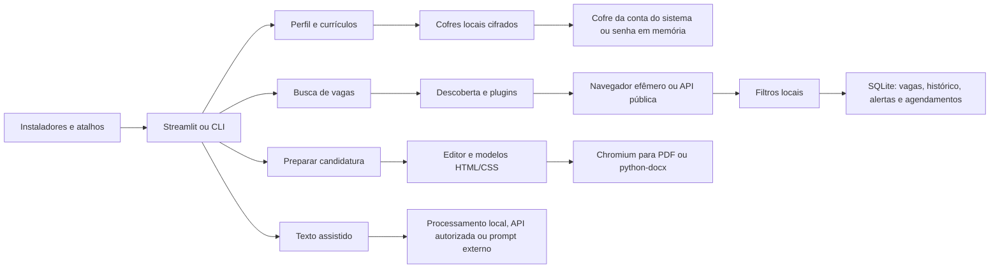

# Arquitetura

## Camadas

| Camada | Responsabilidade |
|---|---|
| `app.py` e `app_pages/` | navegação e formulários Streamlit |
| `dashboard.py` e `ui/` | composição visual e contexto da sessão |
| `services/` | coleta automática, busca assistida, descoberta e agendamento |
| `plugins/` | regras mínimas de cada portal público |
| `config/job_sources.yml` | endpoints públicos e páginas de empresas, sem segredos |
| `core/browser/` | contrato do navegador, segurança de URL e Playwright |
| `profile.py` | Perfil profissional e preferências |
| `location.py` | validação offline de cidade/UF, país e distância |
| `resumes/` | biblioteca, importação, HTML, PDF e DOCX |
| `ai/` e `config/ai.py` | módulos de texto e autorizações |
| `storage/` | persistência SQLite |
| `security.py` | cofres, chaves, gravação atômica e limites |

## Coleta

1. A interface transforma cargos e filtros em consultas por portal.
2. O registro escolhe o plugin correspondente.
3. O plugin aceita somente HTTPS e domínios permitidos.
4. O navegador abre um contexto efêmero sem perfil persistente.
5. HTML e JSON-LD são normalizados como `JobInput`.
6. A política comum valida Brasil, distância, modalidade e indicação PCD quando solicitada.
7. O repositório deduplica e registra mudanças.
8. Se uma fonte falhar, as demais continuam funcionando.

Adzuna, Gupy, LinkedIn, Indeed, Mindsight, Lato Jobs, Vagas.com, Sólides, InHire,
Empregos.com.br e Empregando Brasil possuem descoberta automática. A Adzuna usa a API oficial com
chaves mantidas fora da URL registrada; as demais usam páginas ou respostas públicas limitadas.
Greenhouse, Lever, Ashby, SmartRecruiters, Recruitee e Workable usam APIs públicas por empresa
declarada no catálogo. O painel avançado cobre também uma vaga direta da Sólides e páginas públicas
específicas do Workday.

Jobbol, ProgramaThor e BNE usam outra rota: o serviço monta uma URL de pesquisa com filtros e a
interface a abre no navegador padrão. Não há coleta, cópia de cookies ou controle da sessão nesses
portais. Os quatro modos (`automatic`, `partial`, `assisted` e `external`)
mantêm essa política separada da lista de endpoints configuráveis.

## Compatibilidade

O cálculo usa somente o Perfil salvo:

| Sinal | Peso |
|---|---|
| cargo ou família profissional | 35% |
| senioridade | 25% |
| competências | 25% |
| distância e modalidade | 15% |

Filtros escolhem o acervo; não elevam a nota. Tetos de senioridade e incompatibilidade profissional
evitam pontuações altas por coincidências genéricas. Distâncias usam dados GeoNames locais.

## Currículo

Dados importados são normalizados e revisados antes da geração. O HTML usa um modelo fixo, escapa o
conteúdo e bloqueia JavaScript e recursos remotos. O Chromium temporário imprime o PDF, enquanto o
python-docx gera a versão DOCX. As sugestões de texto ficam separadas até você aproveitá-las.

## Dados

- SQLite armazena vagas públicas, coletas, histórico, alertas e agendamentos.
- Cofres independentes armazenam Perfil, documentos, configuração de IA e chaves opcionais de API.
- O SQLite não é cifrado e não recebe o Perfil, currículos ou credenciais.
- Os cofres usam Fernet com chaves derivadas por Argon2id (64 MiB, três passagens, quatro trilhas) e
  salt aleatório de 16 bytes por gravação. O leitor aceita o formato legado PBKDF2-HMAC-SHA256 de
  600.000 iterações e o regrava em Argon2id logo após uma abertura bem-sucedida.
- A chave ativa fica apenas na sessão.
- Os arquivos gerados ficam na sessão até você baixá-los.
- Vagas não observadas por 60 dias são arquivadas e retornam ao acervo ativo quando reaparecem.

## Execução local

Os inicializadores validam a porta 8501, iniciam uma instância ligada a `127.0.0.1` e registram o
identificador do processo em `data/quati.pid`. No Windows, o resolvedor percorre os processos-pais
porque a porta pode pertencer a um processo-filho do Streamlit. Um arquivo separado identifica o
watchdog, impedindo que dois atalhos disputem o ciclo de vida da mesma instância.

Eles acompanham as conexões locais e, depois que a última aba é fechada, validam caminho e linha de
comando antes de finalizar toda a árvore do app. **Encerrar** grava um pedido local que o
watchdog consome imediatamente. O intervalo de tolerância das conexões evita encerramentos durante
uma recarga da página.
