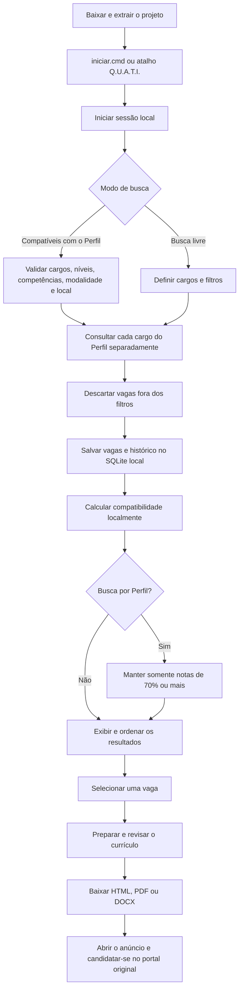

# Guia de uso

## Abrir e encerrar

No Windows, abra `iniciar.cmd` ou **Q.U.A.T.I.** pela Área de Trabalho. No Linux, use
**Q.U.A.T.I.** no menu de aplicativos. Para fechar, escolha **Encerrar** no menu. Fechar
todas as abas também encerra automaticamente o serviço local e a porta após um pequeno intervalo.
O botão de encerramento age imediatamente e não abre uma segunda confirmação.

O navegador abre `http://127.0.0.1:8501`. Reabrir o atalho mostra a instância existente; o
inicializador bloqueia uma segunda instância na mesma porta. Se houver várias abas abertas, o
servidor só encerra depois que a última for fechada.

## Primeiro acesso

O perfil ajuda a calcular a compatibilidade e preencher os filtros, mas não é obrigatório. Você
pode abrir **Buscar vagas**, informar uma profissão e pesquisar sem cadastrar dados pessoais.

Se quiser manter um perfil, escolha como protegê-lo:

- deixe a senha local vazia para usar uma chave aleatória guardada pelo cofre do sistema;
- ou informe uma senha local ao iniciar cada sessão; não há tamanho mínimo obrigatório.

Para o uso no mesmo computador, deixar o campo vazio é a opção recomendada: não há senha para
decorar, e a chave fica protegida pela conta do sistema. Se preferir uma senha própria, use uma senha
forte e guarde-a num gerenciador: sem ela, o perfil não pode ser recuperado. O botão **Bloquear** remove da sessão as chaves, o Perfil e os
documentos abertos.

Se perder a senha, abra **Esqueci a senha** na primeira tela. Não há senha mestra: o Q.U.A.T.I.
apaga somente Perfil, currículos e configurações cifradas para permitir um novo começo. Vagas
públicas e histórico no SQLite são preservados.

## Fluxo do aplicativo

O perfil é opcional para pesquisar. Ele só entra no fluxo quando você quer ordenar resultados por
compatibilidade ou reaproveitar dados na preparação do currículo.

### Onde ficam armazenados os dados das buscas e do perfil?

Por padrão, os arquivos ficam em `data`, dentro da pasta em que o Q.U.A.T.I. foi extraído:

| Arquivo | O que fica armazenado |
|---|---|
| `data/quati.sqlite3` | vagas públicas, URLs de coleta, execuções, histórico, alertas, candidaturas e buscas agendadas |
| `data/candidate-profile.enc` | dados e preferências do Perfil |
| `data/candidate-resumes.enc` | currículos originais e o texto extraído |
| `data/ai-configuration.enc` | módulo de IA, autorizações e credenciais opcionais |
| `data/job-source-configuration.enc` | credenciais opcionais de APIs de vagas |
| `data/runtime.log` e `data/runtime-error.log` | diagnóstico da inicialização |

Os campos da busca atual ficam na memória da sessão. Ao fechar o app, eles desaparecem, exceto se a
busca tiver sido salva como agendamento. As vagas coletadas e o histórico permanecem no SQLite.
Definir `QUATI_DB` é uma opção avançada: ela muda o caminho do SQLite e coloca os cofres `.enc` na
mesma pasta escolhida.

O SQLite não é cifrado, pois guarda principalmente anúncios públicos e o estado operacional da
busca. Perfil, currículos e credenciais não são armazenados nele.

### Como funciona a criptografia?

1. Cada cofre transforma seus dados em JSON e cria um salt aleatório de 16 bytes.
2. O Q.U.A.T.I. deriva uma chave com Argon2id, usando 64 MiB de memória, três passagens e quatro
   trilhas de processamento.
3. Fernet cifra o conteúdo e verifica sua integridade; uma alteração indevida impede a abertura.
4. A gravação usa um arquivo temporário e uma substituição atômica para reduzir o risco de corrupção.

Cofres criados antes desta versão com PBKDF2-HMAC-SHA256 e 600.000 iterações continuam legíveis. O
formato possui versão e, após a abertura com a senha correta, é imediatamente regravado em Argon2id
por substituição atômica. Assim, a cópia antiga não permanece como um segundo cofre.

Se você informar uma senha local, ela não é gravada: permanece somente na memória até **Bloquear
dados** ou encerrar a sessão. Se deixar a senha vazia, o app cria uma chave aleatória e a guarda no
cofre seguro da sua conta no sistema operacional. Nesse modo, um backup dos arquivos `.enc` pode
depender da mesma conta e do mesmo cofre do sistema para ser aberto.

Perder a senha ou a chave do sistema torna o conteúdo desses cofres irrecuperável. O projeto não
possui chave mestra nem serviço remoto de recuperação. **Esqueci a senha** remove os cofres privados
e permite criar outros, sem apagar vagas públicas e histórico.

Essa é a escolha mais segura para a versão local: cofre do sistema como padrão e nenhuma porta dos
fundos. Uma recuperação que preservasse os dados exigiria outra arquitetura, com uma chave
aleatória de dados protegida separadamente pela senha e por um código de recuperação. Isso só deve
ser adicionado com migração de formato, tela de backup e testes próprios; perguntas secretas ou uma
senha universal não são alternativas seguras.

## Perfil e configurações

Abra **Meu perfil → Dados pessoais** para preencher as informações ou importar um PDF/DOCX. A importação cria
um rascunho, então confira cada campo antes de salvar. Você pode cadastrar até cinco cargos ou
áreas, além dos níveis, cidade-base, raio e modalidades que aceita.

O menu separa os assuntos para deixar claro o destino de cada dado:

- **Meu perfil → Dados pessoais:** informações profissionais e preferências de busca;
- **Meu perfil → Currículos:** arquivos originais e versões organizadas;
- **Configurações → Inteligência artificial:** módulo de texto, modelo, autorização e chave de API;
- **Configurações → Adzuna e fontes:** credenciais da Adzuna e catálogo de portais.

O **Assistente** faz parte do fluxo de trabalho e aparece junto de Buscar vagas e Preparar
candidatura, não dentro do perfil.

O Q.U.A.T.I. não conecta contas ou sessões de portais. As fontes públicas são escolhidas diretamente em
**Buscar vagas**.

### Apagar dados locais

No fim de **Meu perfil → Dados pessoais**, escolha **Apagar dados locais e começar do zero**. Depois de duas
confirmações, o aplicativo remove perfil, currículos, configuração de IA, vagas, histórico,
alertas, agendamentos, chaves de APIs de busca e a chave local. A ação é definitiva.

## Currículos

Arquivos PDF e DOCX podem ter até 10 MB. A biblioteca aceita 20 versões e 50 MB no total. Use nomes
curtos que expliquem a finalidade, como `Suporte`, `Administrativo` ou `Engenharia`.

Arquivos escaneados e layouts com muitas colunas podem exigir correções manuais. O app mostra o
texto extraído para você revisar antes de salvar.

## Buscar vagas

1. Abra **Buscar vagas** e escolha **Busca livre** ou **Compatíveis com o Perfil**.
2. Na busca livre, informe até cinco cargos e, se quiser, uma frase adicional.
3. Na busca por Perfil, complete os campos indicados e confirme o resumo mostrado pelo app.
4. Escolha o período e os portais. A busca livre também oferece localização, nível, modalidade e PCD.
5. Clique em **Buscar vagas** ou **Buscar vagas compatíveis**.

Com o perfil aberto, cargos e localização começam preenchidos com suas preferências. Portais,
níveis e modalidades são escolhidos em cada busca. As competências do perfil entram no cálculo da
compatibilidade, mas não impedem que você pesquise outra profissão.

Uma expressão como `segurança da informação` é enviada inteira ao portal. Cada portal decide se
procura a frase exata ou suas palavras. Quando o Q.U.A.T.I. filtra uma página geral de empresa, a
frase completa tem prioridade e, na ausência dela, são consideradas palavras relevantes inteiras;
fragmentos arbitrários não contam. Vários cargos geram consultas individuais, uma por cargo.

No modo **Compatíveis com o Perfil**, o app usa os cargos já salvos, valida os dados necessários e,
depois da coleta, exibe apenas vagas com nota igual ou superior a 70%. O texto do Perfil não é
enviado aos portais. Consulte [Busca e compatibilidade](COMPATIBILITY.md) para a fórmula, limitações
e bases ocupacionais avaliadas.

As fontes automáticas gerais são Adzuna, Gupy, LinkedIn, Indeed, Mindsight, Lato Jobs, Vagas.com,
Sólides, InHire por empresas configuradas, Empregos.com.br e Empregando Brasil. Greenhouse, Lever,
Ashby, SmartRecruiters, Recruitee e Workable consultam APIs públicas das empresas presentes no
catálogo. Cada fonte falha isoladamente. A Adzuna precisa de
credenciais próprias da API e o app guarda essas chaves num cofre local. A Sólides usa a busca
pública sem conta e também aceita a URL de uma vaga individual. Workday aceita uma página pública
específica.

Jobbol, ProgramaThor e BNE geram uma pesquisa assistida por cargo com os filtros suportados. Clique
nos links exibidos para continuar na página pública. O Q.U.A.T.I. não lê resultados, cookies ou
sessões desses três portais.

### Ativar a Adzuna

1. Crie uma conta de desenvolvedor em <https://developer.adzuna.com/register>.
2. Copie o `app_id` e a `app_key` fornecidos no painel da Adzuna.
3. Abra **Configurações → Adzuna e fontes**.
4. Informe as duas credenciais e escolha **Salvar e ativar**.

Não há sandbox nem chave pública de demonstração documentada. O conector e os testes do projeto
usam respostas sintéticas; resultados reais só aparecem depois da configuração.

O filtro PCD procura uma indicação explícita no anúncio. Essa escolha não é salva como informação
pessoal no perfil. O PCD.com.br fica como atalho externo porque seus termos não autorizam coleta
por robôs sem permissão escrita.

### Localização e modalidade

| Escolha | Resultado mantido |
|---|---|
| Estado e cidade preenchidos, sem modalidade | vagas presenciais ou híbridas dentro do raio |
| Estado e cidade preenchidos e Remoto | vagas remotas do Brasil |
| Estado, cidade e modalidades combinadas | remotas nacionais e vagas locais dentro do raio |
| Estado sem cidade | vagas presenciais ou híbridas identificadas naquela UF |
| Sem estado e apenas Remoto | vagas remotas do Brasil |
| Sem estado e sem modalidade | vagas disponíveis em todo o Brasil |

Cada portal recebe os filtros que oferece. Antes de salvar uma vaga, o Q.U.A.T.I. confere país,
distância e modalidade localmente. Se a fonte não informar algo necessário para confirmar um
filtro escolhido, a vaga pode ficar fora do resultado.

Depois da busca, **“X vagas descartadas por não atenderem aos filtros”** significa que os portais
devolveram resultados mais amplos, mas o Q.U.A.T.I. não os salvou nem exibiu porque divergiam de
localização, modalidade, indicação PCD ou, em páginas gerais de empresas, dos termos pesquisados.
Isso é um filtro normal, não uma falha da coleta.

Os nomes são validados numa base GeoNames distribuída com o aplicativo. Isso evita combinações
inválidas de cidade e UF sem fazer consultas externas. Grafias ausentes ou muito recentes devem
ser relatadas para atualização da base.

### Resultados e compatibilidade

Com o perfil aberto, a ordem considera:

- cargo ou área: 35%;
- senioridade: 25%;
- competências: 25%;
- proximidade e modalidade: 15%.

Os filtros definem quais vagas entram na pesquisa, mas não aumentam a nota. Uma vaga um nível acima
do perfil recebe no máximo 70%; dois ou mais níveis acima, 45%. Os detalhes da compatibilidade
mostram pontos fortes, diferenças e informações que faltam.

O valor de 70% é um corte transparente de triagem, não uma probabilidade de contratação.

Use os filtros de texto, empresa, local, fonte, nível, modalidade e nota mínima. A visualização
inicial cobre os últimos 30 dias. Vagas sem nova observação por 60 dias são arquivadas e voltam ao
acervo ativo quando reaparecem.

Portais externos, como GeekHunter, abrem no navegador. Eles não entram na coleta automática sem
autorização do responsável pelo site.

### Catálogo de fontes

`config/job_sources.yml` reúne endereços públicos, empresas consultadas por API e páginas Gupy
como atalhos assistidos. Depois de editar o arquivo, reinicie o aplicativo. Também é possível apontar
para outro catálogo com `QUATI_SOURCES_FILE` ou substituir um endpoint público com variáveis
como `QUATI_SOURCE_LINKEDIN_SEARCH_URL`.

O aplicativo valida HTTPS e o domínio oficial de cada fonte. Não coloque chaves de API, cookies,
senhas ou links privados nesse arquivo.

## Preparar e aplicar

1. Escolha uma vaga.
2. Selecione um currículo da biblioteca ou os dados do Perfil.
3. Gere sugestões de texto ou use o prompt externo.
4. Edite o conteúdo, escolha entre cinco modelos e ajuste seções, densidade e cor.
5. Revise a prévia.
6. Baixe HTML, PDF ou DOCX.
7. Abra a vaga original e conclua o formulário.

As sugestões aparecem separadas e você decide o que aproveitar. HTML/CSS cuida do visual e o
Chromium gera o PDF no seu computador.

## Assistente

Configure um módulo em **Inteligência artificial**. A autorização para provedores externos fica
nessa tela e persiste até ser alterada. Se houver um Perfil salvo, ele entra automaticamente como
contexto do Assistente.

A conversa existe apenas durante a sessão aberta. O Assistente tem um atalho para a biblioteca de
currículos e trabalha apenas com texto.

## Buscas agendadas

Uma busca agendada repete uma URL pública, atualiza as vagas e cria alertas. Você pode executá-la
pelo botão **Executar buscas pendentes agora**, por uma tarefa periódica do sistema ou pelo serviço
de automação do Compose. No Agendador de Tarefas do Windows, use
`scripts\run-scheduler.ps1` como o script periódico do projeto.

O aplicativo aberto não transforma a tela em um serviço contínuo: somente o botão, a tarefa do
sistema ou o serviço do Compose executa as buscas que chegaram ao horário. Para interromper uma
programação sem apagá-la, selecione-a e use **Desativar**. Para excluí-la, selecione-a e use
**Remover agendamento**. A remoção apaga apenas a programação; vagas, alertas e histórico já
coletados permanecem.

Em **Acompanhamento → Histórico de vagas** ficam as buscas realizadas e as mudanças detectadas nos
anúncios. **Acompanhamento → Logs técnicos** contém somente mensagens de diagnóstico do programa.

## Backup

Encerre o aplicativo e copie a pasta `data` para um local privado. Esse backup contém dados
pessoais: não o envie ao GitHub, por e-mail ou para uma pasta compartilhada sem proteção.
